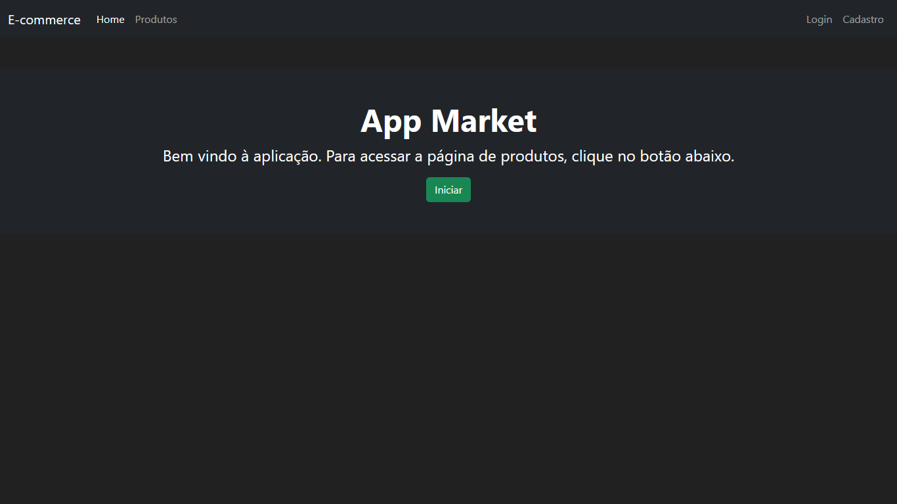
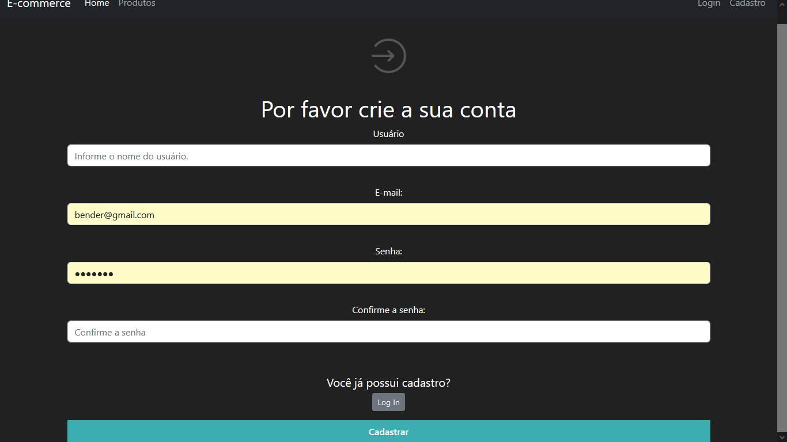
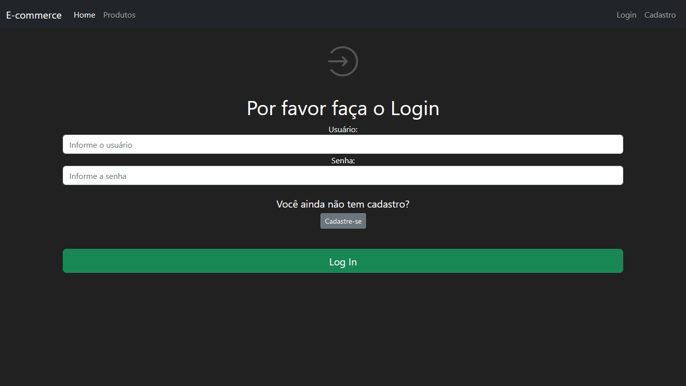
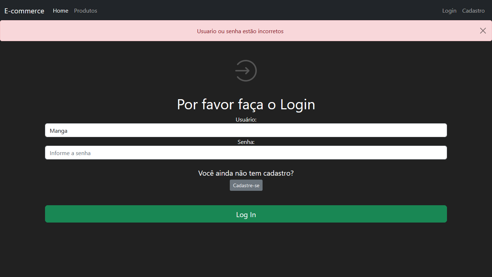
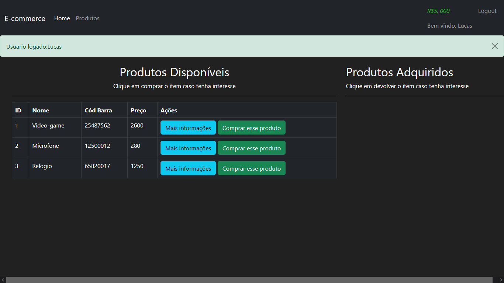
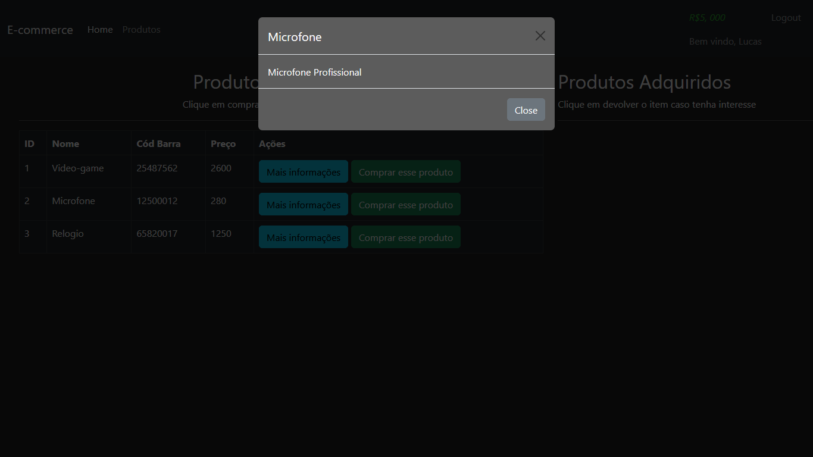
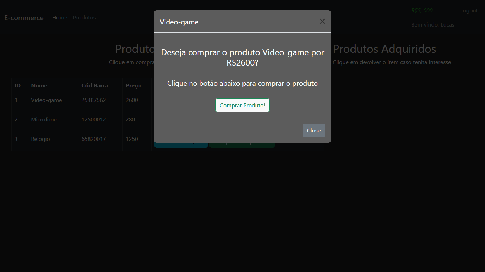
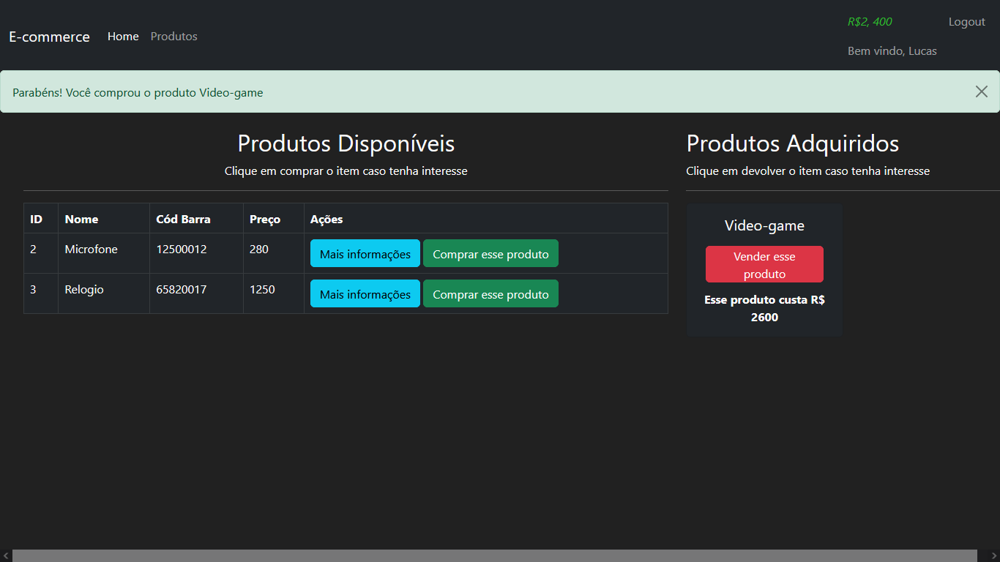
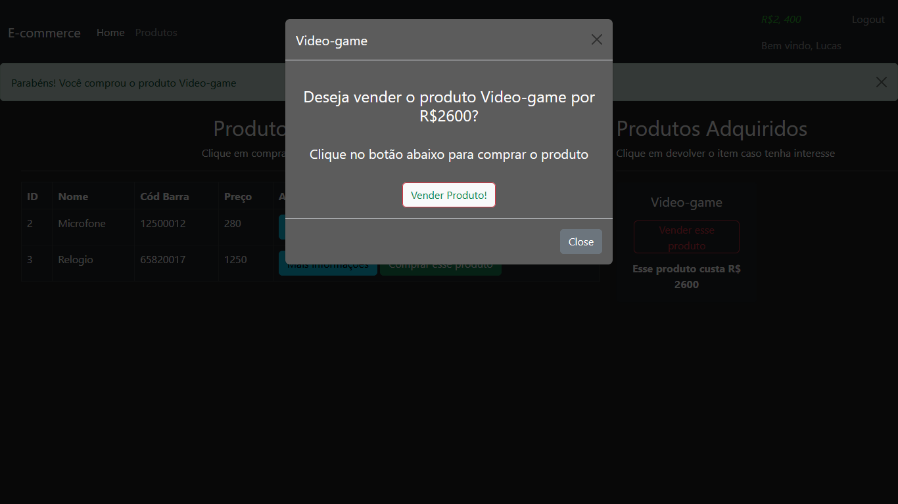

<h1>Aplicativo Market Flask Udemy</h1>
 

Este é um exercicio realizado seguindo um curso da Udemy, Bootcamp Flask Python.

 
<h2>Layout Tela Inicial </h2>
 

 
<h2>Layout Tela Cadastro</h2>
 

 
<h2>Layout Tela Login </h2>
 

 
<h2>Layout Tela Login mensagem de erro</h2>
 

 
<h2>Layout Tela Produtos </h2>
 

 
<h2>Layout Tela Informações do produto</h2>
 

 
<h2>Layout Tela Formulário de compra</h2>
 

 
<h2>Layout Tela Produto adquirido</h2>
 

 
<h2>Layout Tela Venda Produto</h2>
 

 
<h2>Curso da Udemy </h2>
 

 
<h3>Sobre o curso</h3>
 

Neste curso, eu senti dificuldades em relação as libs que são baixadas e instaladas no ambiente virtual. Resolvi fazer esse curso após realizar o trabalho de uma casa de cambio para um amigo, onde foi necessário fazer a integração de dados, e assim conheci o flask. Ainda tenho mais dois exercicios desse curso para serem feitos.

 